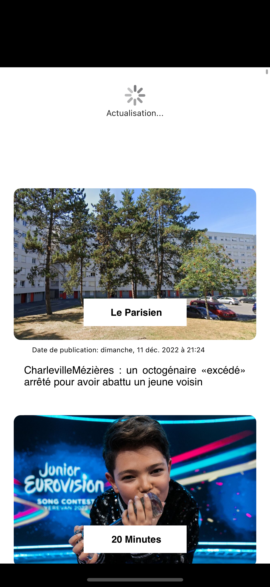
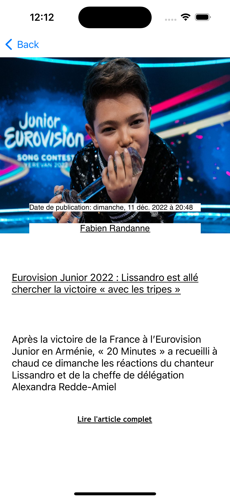

# NewsApp

  </img> 
</p/

News app is a simple iOS app build with Swift in a clean code architecture pattern: MVVM

MVVM stands for Model, View, ViewModel. In this app we try to respect the responsabilities of each layer to make the code reusable and clear

## Technical Environment used during the development phase

- XCode 14.1 Silicon Chip
- MacOS Ventura 13.0.1
- MacBook Air M1 Silicon

## Prerequisites to build the app

To build the app, it is important to have the following elements:

- MacOS one of the latest version
- Xcode one of the latest version

Warning: One more thing, in order to get the data from the api, it's a must to put your (https://newsapi.org/) apiKey value in the apiKeys PList file

## Technical presentation of the project

Like said before, i build this app following the MVVM pattern.

This app (the MVP) contains two screens: the "HomeScreen": HomeTabBarItemScreenViewController and the "DetailsScreen": ArticleDetailsScreenViewController.

Each of these screens are managed via a fluid communication between the views, the viewsModels and the models, through some services api requests and routing aspects managed outside these three layers.

A simple use case that illustrate the communication flow is the following:

When the HomeScreen is about to appear, the viewController ask to its ViewModel to provide him the data its need to display the news. When getting the request, the viewModel ask to the corresponding service to provide him the data from the api, and to decode them matching the model that is given. When the service layer finishes its request, its notify the viewModel via the delegate pattern, which also notify the view about the end of the data loading. To finish, the view ask for its viewModel to give him the data in an easy presentation way, and when getting the datas, its show them to the user interface.
I choose the delegate pattern as binding and communication type between layers, because of its simplicity and effectiveness

Another important part of the architecture of this project is the routing part. I choose to not put the routing logic in one of the MVVM layers because for me its not one of their responsibilities.

To summarize, the different parts of this project architecture are MVVM + Service + Routing

## What to improve

- The first thing to improve in this app is the network calls error management. I've create the path to ease the error management but ive not implemented them
- Set up an authentification system for the app, that will allow user to have data extra features like local data storages of their last api request result before a lost of internet connection and distant storages of the articles they save
- I wanted to build a UITabBar, with the homeScreen, a librairy screen in which there would be the news that the user save with his account and a search menu in which the user would be allow to search news related to specific words, and also find categories grouped by category.
For this last point, I build on the code, especially in the NewsService.swift file, the network requests to get the news of a category; and the one for articles related to the user's keywords
- Make so automated UI Tests and units tests to validate the network data parsing for example and other features
- Prettify the User Interface; and take into account the dark theme

## App screenshots

<table>
  <tr>
    <td>
 HOME SCREEN
</td>
    <td>
 PULL TO REFRESH
</td>
    <td>
 DETAIL SCREEN
</td>
   </tr> 
   <tr>
      <td></td>
      <td></td>
      <td>
  </td>
  </tr>
</table>

